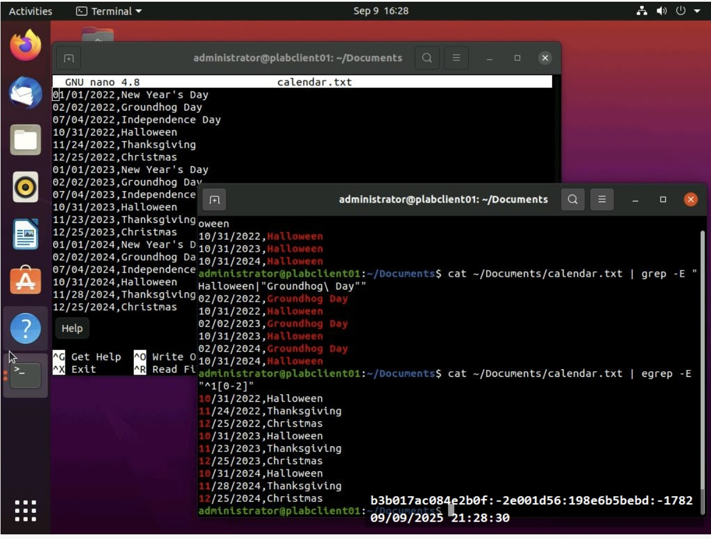
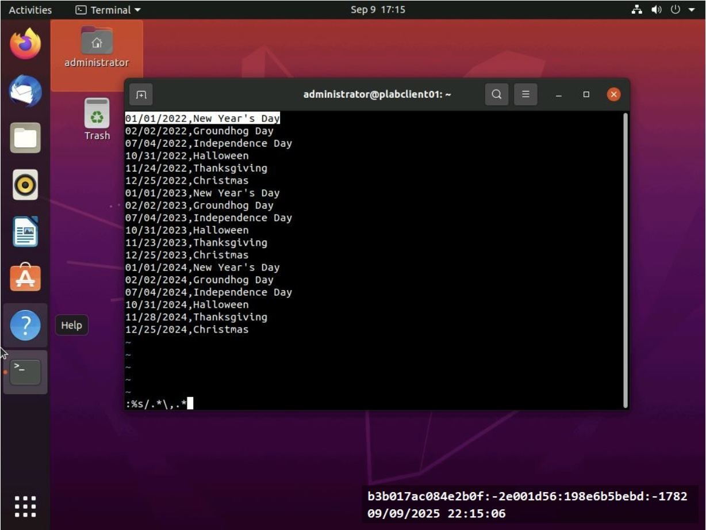
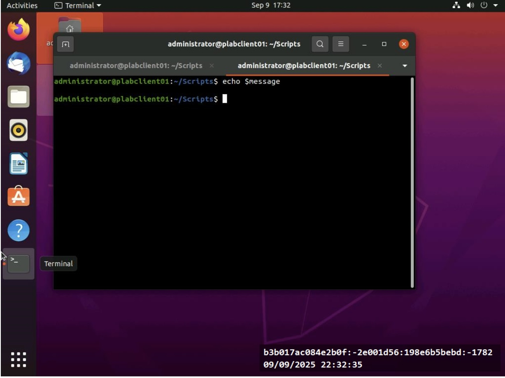
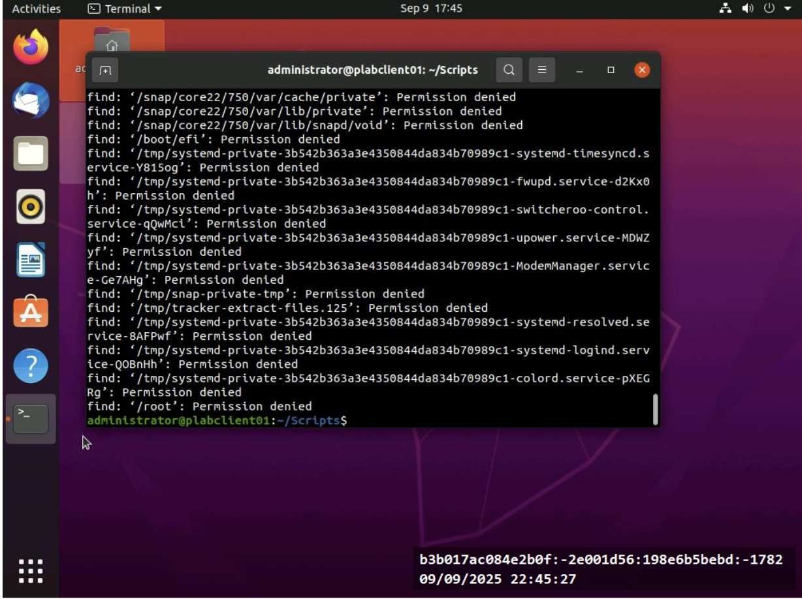
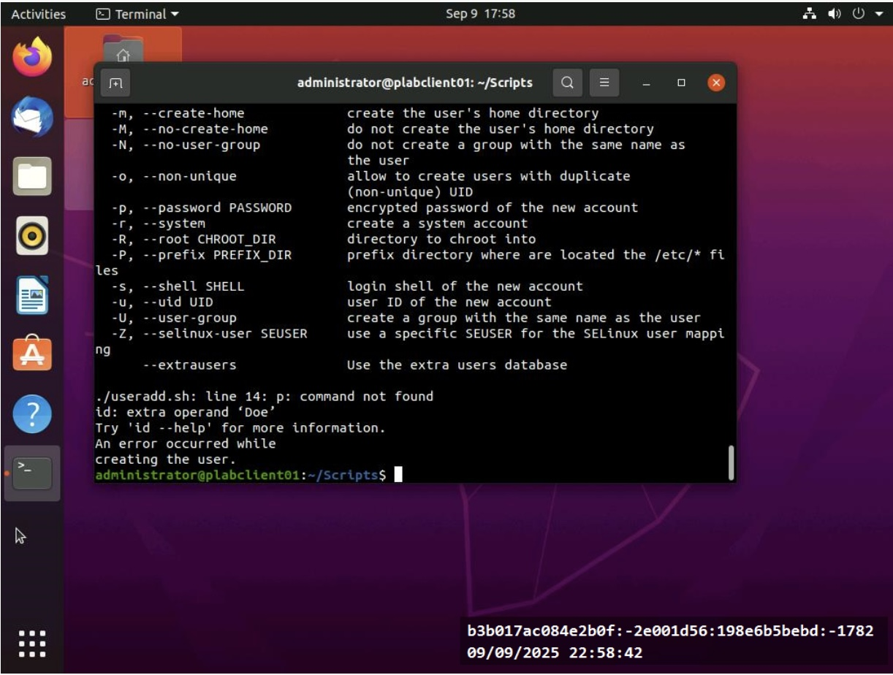

# Linux-Scripting-Techniques
## Project Overview 
This project demonstrates basic Linux shell scripting skills, including command usage, file processing, and text filtering using grep 
and egrep.

## Skills Demonstrated
- Linux command line usage
- User and file management
- Text processing with grep/egrep
- Basic shell scripting
- Troubleshooting and system navigation

## Tools Used
- Linux (Fedora/Ubuntu)
- Bash Shell
- Terminal commands

## Tasks Performed
- Created and managed users and groups
- Navigated file systems using Linux commands
- Filtered and searched text using grep and egrep
- Practiced file permissions and ownership
- Executed basic shell commands for system tasks

## What i learned
This Project helped me understand how to work with Linx system, use command-line tools efficiently, and performbasic administrationtasks, 
tasks , which are important for IT support and help desk roles.

## Screenshots

which are important for IT support and help desk roles .
